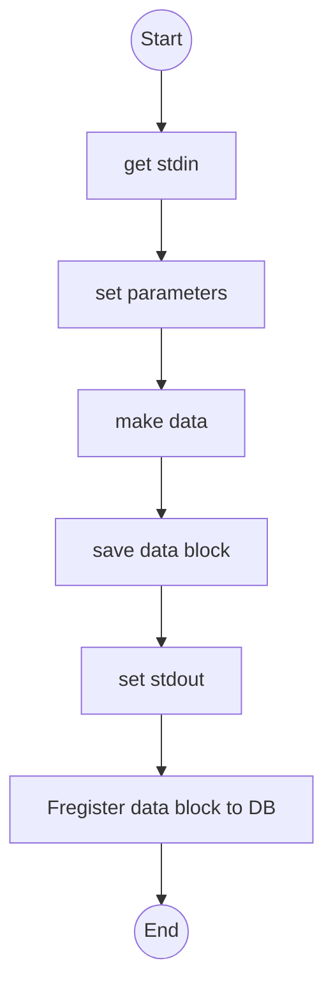

# function name

FGDB func1 : function block conneted to root

## environment 

> pip list

## files

### basic files
func.m ... operation code
readme.json ... stdin/out & function information
README.md ... readme

## Flowchart

## execute

'born founcdr'
> python function.py

'born successor'
> python function.py [parent id]

## output

<born founcdr>

born founcdr
making block directory: ./5bf883778c0edcc6ee9e24a400c3b0f565aed6346ab2060da6cd729ae191c495
I am Wxv5ax-bDneMl .
I was born on  2023-05-23 20:18:47.264676 .
My parent is None .
My code is 5bf883778c0edcc6ee9e24a400c3b0f565aed6346ab2060da6cd729ae191c495 .

<born successor>

born successor
load block from directory: 5bf883778c0edcc6ee9e24a400c3b0f565aed6346ab2060da6cd729ae191c495
making block directory: ./79fadc656bc94ddaaaff212faecbc668b80a292754f3d23f910d432fe8db0f1d
I am auGxVR-bDneMl .
I was born on  2023-05-23 20:18:47.285675 .
My parent is 5bf883778c0edcc6ee9e24a400c3b0f565aed6346ab2060da6cd729ae191c495 .
My code is 79fadc656bc94ddaaaff212faecbc668b80a292754f3d23f910d432fe8db0f1d .
